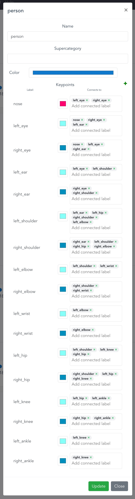
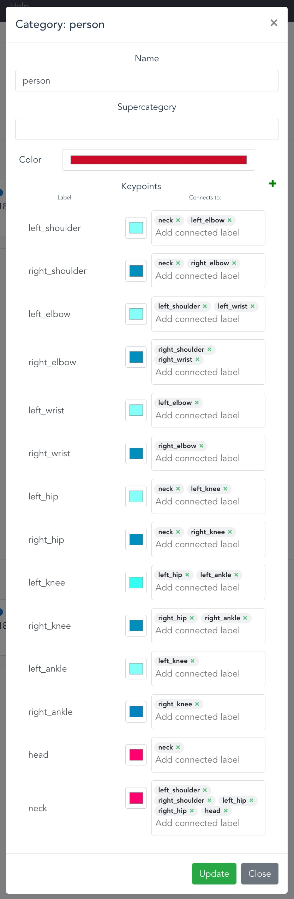

# Keypoint annotation with coco-annotator
## 1. Install & run in Docker
- Clone [coco-annotator](https://github.com/jsbroks/coco-annotator) and run `docker compose up`
- Open http://localhost:5000 (standard port)
- Create a new account / login

**Note [macOS]**: In order to run coco-annotator on macOS, the docker compose file needs two changes. See [here](https://github.com/jsbroks/coco-annotator/compare/master...random9v2:coco-annotator:macos#diff-e45e45baeda1c1e73482975a664062aa56f20c03dd9d64a827aba57775bed0d3).

## 2. Create a dataset
- Create an empty dataset; coco-annotator will create an empty folder in root/datasets
- Move your pictures into that folder
- In coco-annotator, click on the dataset and then on "Scan"
- Your images will be imported. You may have to leave/reenter the dataset-tab in order for the images to be shown.

## 3. Create categories
Categories can be created manually in the categories tab or be imported through annotation.json files. If you want to import categories from an annotation file, simply enter a dataset and click "Import COCO". Even if coco-annotator cannot find any pictures mentioned in the annotation file, the categories will be imported nevertheless. Note: a category is only imported when it doesn't already exist.

### Import the COCO keypoint annotation format
- The COCO keypoint annotation format can be imported via a .json file. You'll find an annotation file only containing the category in `configs/coco_keypoint_cat.json`.
- After import, the category "person" is created, which should look like in the following picture (excluding color settings). In order to adjust category settings, click on the category menu (3 dots) and then "settings".

### Import the crowd_pose keypoint annotation format
- Like for COCO, you can import the crowd_pose annotation format with `configs/crowdpose_keypoint_cat.json`. **Note**: crowdpose_keypoint_cat.json uses the "person" category, which will not be imported if it already exists. If you import both, COCO and crowd_pose, you will have to avoid duplicate categories by renaming one. 
- After import, the category should look like this (excluding color settings):

### Adjust keypoint colors
Well-chosen keypoint colors can support the annotation process. The colors chosen in the pictures above help differentiate the keypoint-side (left/right), which can easily be mixed-up during annotation. For reference, above colors are:

- connection color: #0E79CC (coco) / #CA0B29 (crowd_pose)
- center keypoints: #FF006F
- left keypoints: #85FFF7
- right keypoints: #008EBD

## 4. Add the category to datasets
In order for a category to be available in a dataset, edit the dataset and add the category in the "Default Categories" field. 

## 5. Annotate
- Enter a dataset and click on a picture to begin annotating.
- Add an annotation for a specific category (upper right corner).
- Use one of the tools on the left to create an annotation. E.g., the keypoint tool (k) for keypoints.
- Add another annotation (space).
- Save and switch to the next image with the arrow in the top rigth corner of the screen.

### tips for keypoint annotation
- It is often faster to go through the annotation process of a whole person and to adjust/delete keypoint visibility/out of bound keypoints afterwards. Keypoint visibility can be edited by double-clicking a keypoint with the select tool (s). Tag not visible/occluded keypoints with "LABELED NOT_VISIBLE". Do not use "NOT LABELED" for not labeled keypoints, just delete them instead to adhere to the [COCO standard](https://cocodataset.org/#format-data).
- Click on image settings (left sidebar) to show or/and adjust the keyboard shortcuts. 
- [Official documentation](https://github.com/jsbroks/coco-annotator/wiki)
- [COCO keypoint standard](https://cocodataset.org/#format-data)