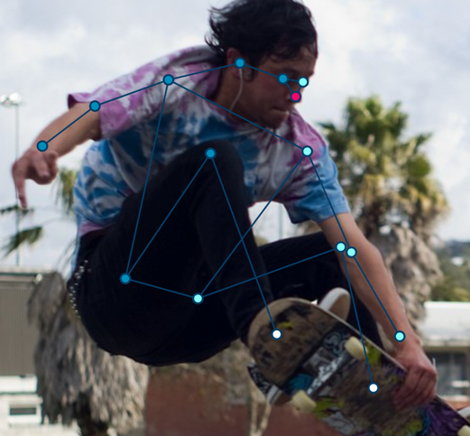
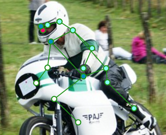

# Annotation guideline for human keypoints
Big available datasets for human pose estimation (COCO, crowd_pose) do not seem to have a sophisticated guideline on how keypoints should be annotated. Both datasets mentioned do not seem to follow consistent annotation rules. E.g., keypoint visibility does sometimes include self-occlusion (a human limb occluding another of the same person) and sometimes not. Generally, keypoint visibility seems to be highly up to an individual annotators' interpretation. The following guidelines are build on the crowd_pose and COCO annotation style, describing rules for logic-consistent annotation. For annotation itself, the [coco-annotator](https://github.com/jsbroks/coco-annotator) was used. Keypoint colors in showed examples are:

- dark blue: right body parts (eye, ear, shoulder, elbow, wrist, hip, knee, ankle)
- light blue: left body parts (eye, ear, shoulder, elbow, wrist, hip, knee, ankle)
- red: center body parts (nose, head, neck)
- white: marked as not visible

# Skeleton vs. surface features
Skeleton features are annotated as if only the human skeleton would be visible – basically annotating the human joints.  

Surface features are the eyes, ears and nose in COCO. They are annotated only if directly visible (see image above).

# Keypoint visibility
According to COCO, the visibility flag for each keypoint can have three states:
- v = 0 for not visible (=not annotated)
- v = 1 for annotated but not visible (occluded)
- v = 2 for annotated and visible

## When is a keypoint not visible?
A keypoint is not visible, when it is occluded by **another object or entity**. A human wearing his clothes is one entity – eyes, ears and nose under a helmet count as visible. Example (white keypoints v = 1):

## When should non-visible keypoints be annotated?
Not visible keypoints are annotated, if:
- 50 % of skeleton keypoints are visible
- there location can be reasonably good guessed